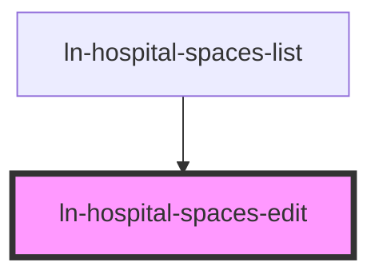

# ln-hospital-spaces-edit

<!-- Auto Generated Below -->

## Properties

| Property            | Attribute | Description | Type       | Default     |
| ------------------- | --------- | ----------- | ---------- | ----------- |
| `existingPavilions` | --        |             | `string[]` | `[]`        |
| `opened`            | `opened`  |             | `boolean`  | `false`     |
| `role`              | `role`    |             | `string`   | `'general'` |
| `space`             | `space`   |             | `any`      | `{}`        |

## Events

| Event           | Description | Type                |
| --------------- | ----------- | ------------------- |
| `editor-closed` |             | `CustomEvent<void>` |
| `editor-saved`  |             | `CustomEvent<any>`  |

## Dependencies

### Used by

 - [ln-hospital-spaces-list](../ln-hospital-spaces-list)

### Graph

----------------------------------------------

*Built with [StencilJS](https://stenciljs.com/)*
