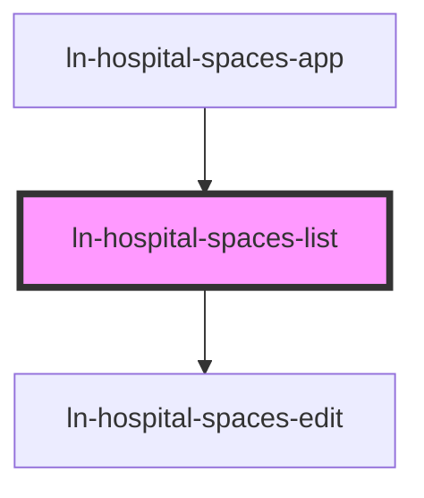

# ln-hospital-spaces-list

<!-- Auto Generated Below -->

## Properties

| Property  | Attribute  | Description | Type                                 | Default     |
| --------- | ---------- | ----------- | ------------------------------------ | ----------- |
| `apiBase` | `api-base` |             | `string`                             | `undefined` |
| `role`    | `role`     |             | `"general" \| "spravca" \| "veduci"` | `'general'` |
| `spaceId` | `space-id` |             | `string`                             | `undefined` |

## Dependencies

### Used by

 - [ln-hospital-spaces-app](../ln-hospital-spaces-app)

### Depends on

- [ln-hospital-spaces-edit](../ln-hospital-spaces-edit)

### Graph

----------------------------------------------

*Built with [StencilJS](https://stenciljs.com/)*
